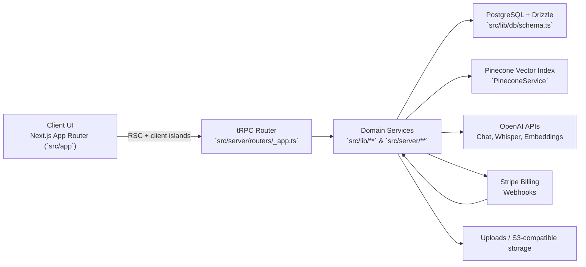
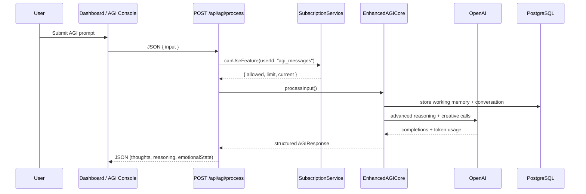
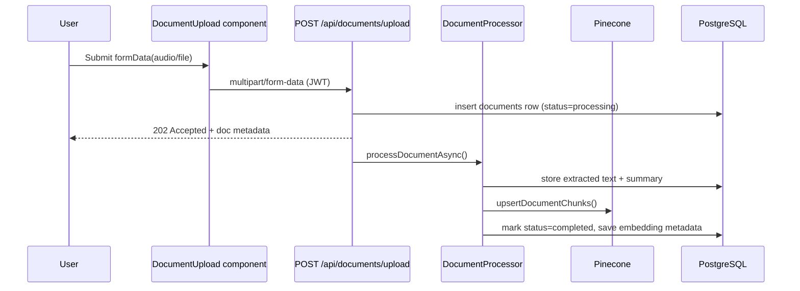
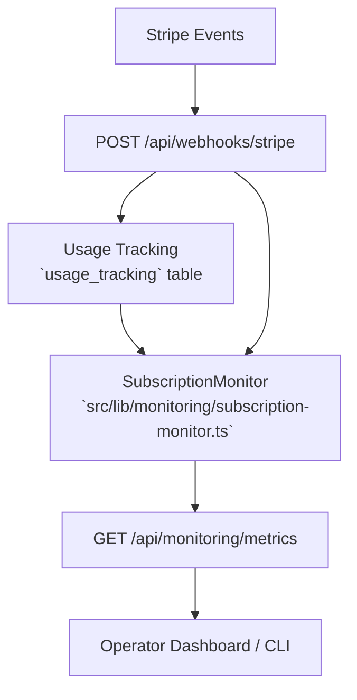

# Apex Agents Architecture
_Last updated: 2025-11-14_

## System Context

**Highlights**
- App Router serves server components by default; client components (e.g., dashboard charts, VoiceCommandPanel) hydrate only where interaction is required.
- All state-changing calls funnel through either tRPC or dedicated API routes; each handler enforces JWT auth and often subscription limits/rate limiting.
- Domain services are clean TypeScript modules; they do not rely on React, which simplifies testing and background execution.

## AGI Request Lifecycle

**Key Safeguards**
- `rateLimit(request, RateLimitPresets.AGI)` caps burst load at 20 req/min per user.
- `SubscriptionService.trackUsage` increments quotas asynchronously; failure to record does not block the response but logs warnings.
- Enhanced AGI stores conversation IDs so downstream audits can replay sessions.

## Document Intelligence Pipeline

**Notes**
- Upload handler enforces MIME whitelist (PDF, DOCX, TXT, MD) and max size (50 MB).
- Pinecone IDs follow `documentId-chunk-{index}` format for deterministic deletion.
- Search endpoint (`POST /api/documents/search`) vectors queries and groups matches by document before returning to the UI.

## Operational Telemetry Flow

**Operational Guardrails**
- `WebhookMonitor` logs processing latency/outcome per Stripe event (success/fail) to aid alerting.
- `/api/debugger` exposes run-time health (overall, unresolved errors, stats) for lightweight probing.
- Health endpoints feed load balancer checks; CI smoke tests call them post-deploy.

