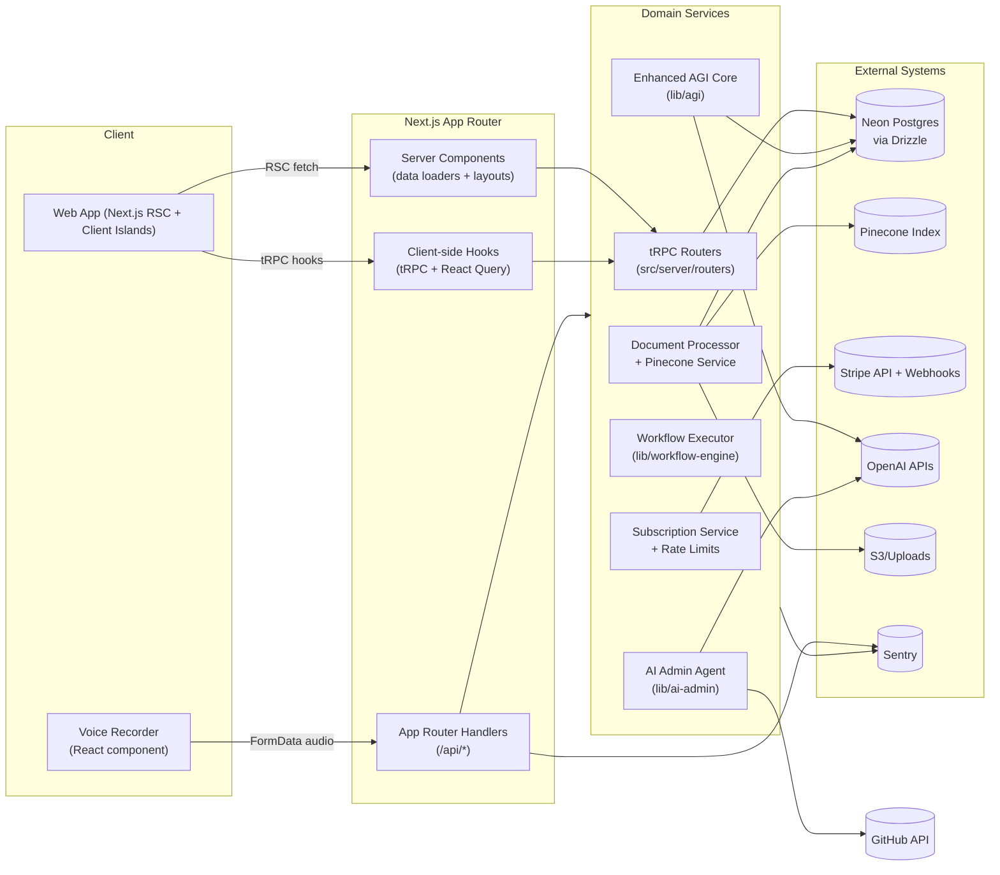
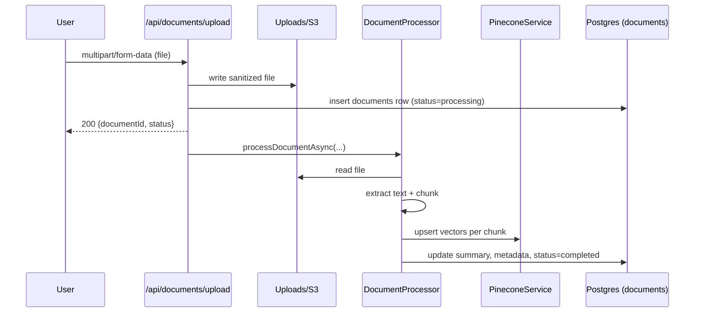
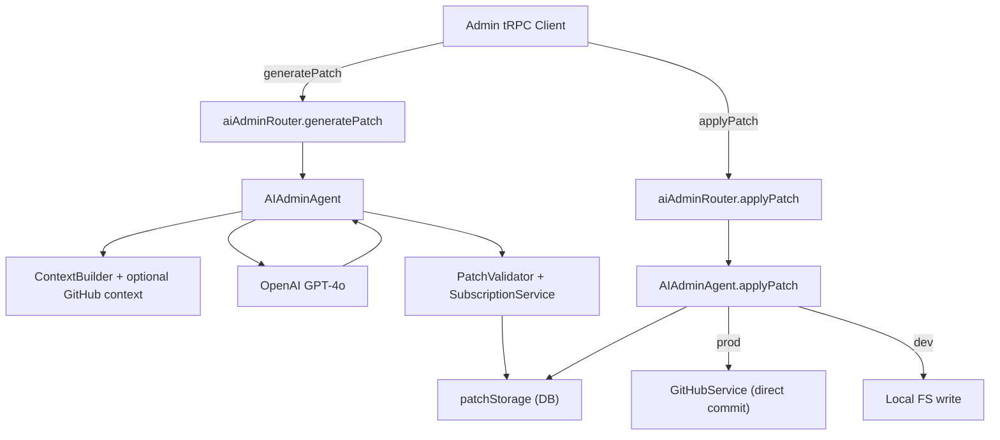

# Apex Agents Architecture

_Mermaid diagrams render in GitHub, Cursor, and most Markdown previewers._

## 1. System Context

_Think of this as a transit hub: the App Router is Grand Central Station, tRPC routes act like train lines, and domain services are the long-haul engines moving data to specialized destinations (Postgres, Pinecone, Stripe, OpenAI)._

## 2. Control & Data Planes

| Plane | Components | Description |
| --- | --- | --- |
| **Control plane** | tRPC routers, SubscriptionService, rate limit middleware | Governs who can call what, enforces quotas, and shapes responses for the UI. |
| **Data plane** | AGI core, AI Admin, document pipeline, workflow executor | Performs heavy computation (LLM calls, embeddings, workflow fan-out) and writes durable state. |
| **Observation plane** | `appMonitor`, `/api/health/*`, Sentry, SubscriptionMonitor | Supplies health data, error telemetry, and billing metrics. |

## 3. Pipelines

### 3.1 Document Ingestion & Search

### 3.2 AI Admin Patch Lifecycle

The patch workflow behaves like a code review robot: the agent analyzes context, drafts a change set, hands it to a validator (lint/reasoning), then either files it in GitHub or writes locally, while persisting audit data.

### 3.3 Voice Command Execution

1. Client records audio and posts to `/api/voice`.
2. Route authenticates the user, transcribes audio via Whisper, and asks GPT-4o-mini to map it to `respond`, `get_dashboard_metrics`, or `run_agent`.
3. Commands are executed using `getDashboardMetrics` or `executeAgent`.
4. Response echoes transcript, structured command, and execution payload back to the UI for rendering.

## 4. Deployment Topology

| Environment | Hosting | Notes |
| --- | --- | --- |
| Local | Node 18 + Next dev server | File uploads use local `uploads/`, Stripe webhooks tunneled via CLI, Pinecone optional. |
| Preview | Vercel preview deployments | Uses preview secrets; AI Admin GitHub integration can be disabled safely. |
| Production | Vercel (Node runtime) | `/api/ai-admin/stream` + `/api/voice` explicitly force Node, not Edge; Stripe + Pinecone keys required. |

Supporting services:
- **Postgres (Neon)** – managed; migrations pushed via `drizzle-kit`.
- **Pinecone** – single index `apex-corporate-brain` with metadata filters per `userId`.
- **Stripe** – customer + subscription state mirrored in `subscriptions` table via webhook.
- **Sentry** – DSN optional but recommended; `appMonitor` supplements for internal checks.

## 5. Failure Modes & Mitigations

| Risk | Mitigation |
| --- | --- |
| OpenAI rate limits | `rateLimit` presets for AGI, uploads, voice; fallback responses for AGI. |
| Pinecone/outbound errors | Upload route catches and marks document `failed`, allowing user retry. |
| Stripe webhook failure | `WebhookMonitor` logs status + processing time; endpoint returns 400 on error to trigger Stripe retry. |
| GitHub unavailable | AI Admin logs warning and falls back to local FS application. |
| Subscription overuse | `SubscriptionService.canUseFeature` short-circuits AGI + agent actions and returns upgrade prompts. |

## 6. Reference Materials

- `docs/TECHNICAL-SPEC.md` – system goals and stack definition.
- `docs/API-REFERENCE.md` – HTTP + tRPC contract details.
- `docs/CODE-MODULES.md` – per-module responsibilities and key entrypoints.
- `docs/ONBOARDING-GUIDE.md` – local setup walkthrough.

