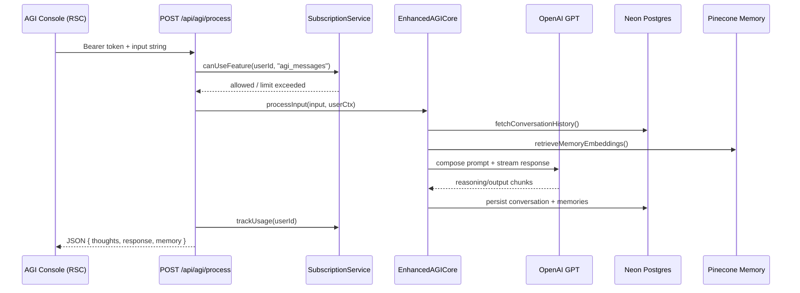

# Apex Agents Architecture

**Last updated:** 2025-11-14

## 1. Layered View
- **Interface:** Next.js App Router pages under `src/app`, Tailwind UI components, client-side TanStack Query hooks.
- **API Surface:** Hybrid of REST (`app/api/*`) for uploads/webhooks/integrations and tRPC (`/api/trpc`) for dashboard data.
- **Domain Services:** `src/lib` houses AGI cores, AI Admin agent, document processor, Pinecone client, subscription enforcement, monitoring, and integration utilities.
- **Data & Messaging:** Neon Postgres via Drizzle, Pinecone vectors, local/S3 document storage, Stripe + Resend webhooks, Sentry telemetry.

## 2. System Context
```mermaid
graph TD
  Browser[Dashboard / Console UI] -->|HTTPS| NextApp[Next.js App Router]
  NextApp -->|tRPC| TRPC[App Router (tRPC)]
  NextApp -->|REST| ApiRoutes[/app/api handlers/]
  TRPC --> Domain[Domain Services (src/lib)]
  ApiRoutes --> Domain
  Domain -->|SQL| Postgres[(Neon Postgres via Drizzle)]
  Domain -->|Vectors| Pinecone[(Pinecone Index)]
  Domain -->|Files| Storage[S3 / Local Uploads]
  Domain -->|LLM Calls| OpenAI[(OpenAI API)]
  Domain --> Stripe[(Stripe Billing)]
  Domain --> Resend[(Resend Email)]
  Domain --> Sentry[(Sentry / Monitoring)]
```

## 3. AGI Request Sequence


## 4. Knowledge Ingestion Pipeline
```mermaid
flowchart LR
  Uploader[Client Upload (50MB cap)] -->|multipart/form-data| UploadAPI[/api/documents/upload]
  UploadAPI -->|persist row| DocsTable[(documents)]
  UploadAPI -->|write temp file| TempStore[(uploads directory/S3)]
  UploadAPI -->|async task| Processor[DocumentProcessor]
  Processor --> TextExtract[Extract text & metadata]
  TextExtract --> Chunker[Chunk + summarize]
  Chunker --> PineconeUpsert[PineconeService.upsertDocumentChunks]
  PineconeUpsert --> Pinecone[(Pinecone Index)]
  Chunker --> DocsUpdate[Update doc row w/ summary & stats]
  DocsUpdate --> DocsTable
  SearchAPI[/api/documents/search] --> Pinecone
  SearchAPI -->|results| ClientSearch
```

## 5. Deployment & Ops Notes
- **Runtime targets:** Next.js server routes execute in Vercel Node runtimes; long-running uploads stay server-side to avoid Edge limits.
- **Background work:** Document processing runs fire-and-forget inside the upload route; consider extracting to queue/worker when throughput increases.
- **Observability:** `src/lib/monitoring` builds summarized metrics for `/api/monitoring/metrics`; `app/api/debugger` exposes health probes for UI dashboards.
- **Extensibility:** New integrations should live inside `src/lib/<domain>` with typed exports that can be consumed by both tRPC procedures and REST handlers.

