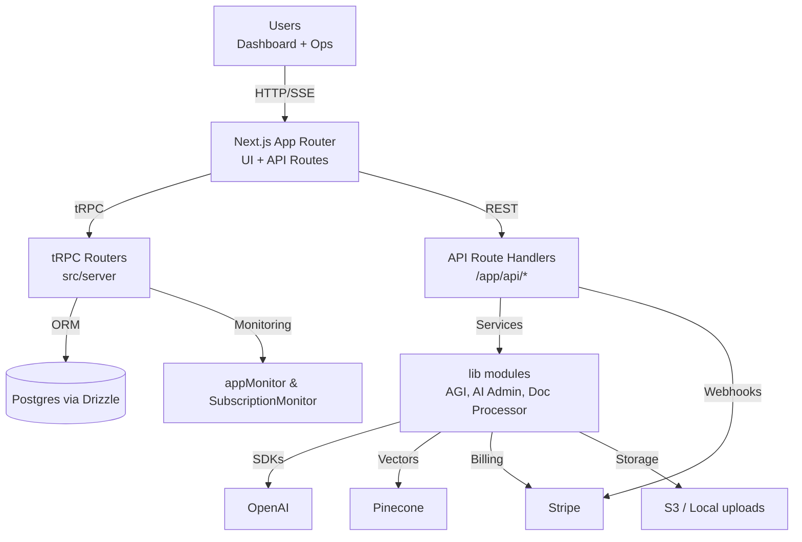
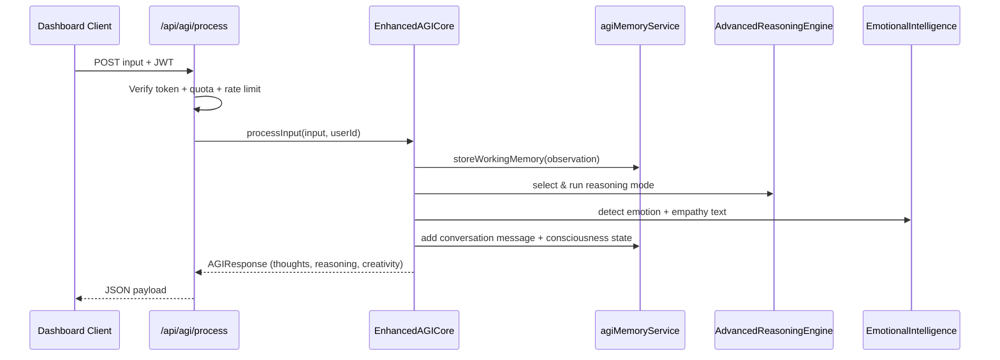

# Apex Agents Architecture

## 1. System Context

- **Flow:** Browser requests hit the Next.js server, which routes to either tRPC or REST handlers. Both layers rely on shared lib modules that access Postgres, external AI APIs, Pinecone, and Stripe.
- **Analogy:** The App Router acts like a train station switchboard, directing each inbound request to the right track (tRPC, REST, SSE) before it reaches the heavy-duty engines (lib services + infra).

## 2. AGI Request Lifecycle

- Every AGI call persists both the user message and the assistant response, allowing later summarization and analytics.

## 3. Knowledge Upload & Search Pipeline
```mermaid
flowchart LR
  U[User Uploads File] --> A[/api/documents/upload/]
  A -->|Store file + DB row| B[documents table]
  A -->|enqueue| C[processDocumentAsync]
  C --> D[DocumentProcessor\nextract text + metadata]
  D --> E[PineconeService\nchunk + embed]
  E --> F[(Pinecone Index)]
  D --> B
  G[Search Request] --> H[/api/documents/search]
  H --> I[PineconeService.searchSimilar]
  I --> H -->|Group chunks| J[Response grouped by document]
```
- Documents are stored locally/S3 for durability, while the semantic representation lives inside Pinecone for fast similarity search.

## 4. Module Interaction Map
| Layer | Key Modules | Responsibilities |
| --- | --- | --- |
| Presentation | `src/app`, `src/components`, `src/contexts` | App Router layouts/pages, client components (agent wizard, workflow builder), theming. |
| API Surface | `src/app/api/*` | REST endpoints for AGI, AI Admin SSE, documents, voice, health, monitoring, Stripe webhooks. |
| RPC Layer | `src/server/trpc`, `src/server/routers/*` | tRPC routers for auth, agents, workflows, analytics, settings, subscription, AI Admin. |
| Domain Services | `src/lib/*` | AGI modules, AI Admin helpers, document processor, Pinecone service, subscription service, monitoring utilities, auth helpers. |
| Data & Infra | `src/lib/db`, `drizzle/*.sql`, `Pinecone`, `Stripe`, `OpenAI` | Schema definitions, migrations, external SaaS integrations. |

## 5. Operational Observability
- `appMonitor` aggregates runtime health, errors, and stats for `/api/debugger`.
- `SubscriptionMonitor` tracks plan usage, expiring users, and produces JSON + plaintext reports.
- `WebhookMonitor` logs Stripe webhook latency and failures for later inspection.
- `tests/debug/system-health.ts` and Playwright suites provide regression coverage.

## 6. Deployment Considerations
- Stateless Next.js server can scale horizontally; all persistent state is in Postgres/Pinecone/S3/Stripe.
- Long-running tasks (document processing, subscription scans) run in background server contexts or queued jobs (current implementation uses fire-and-forget promises; production should offload to a worker).
- Environment variables (OpenAI, Pinecone, Stripe, AWS/S3, ADMIN_UPGRADE_SECRET) must be present wherever API routes run.

